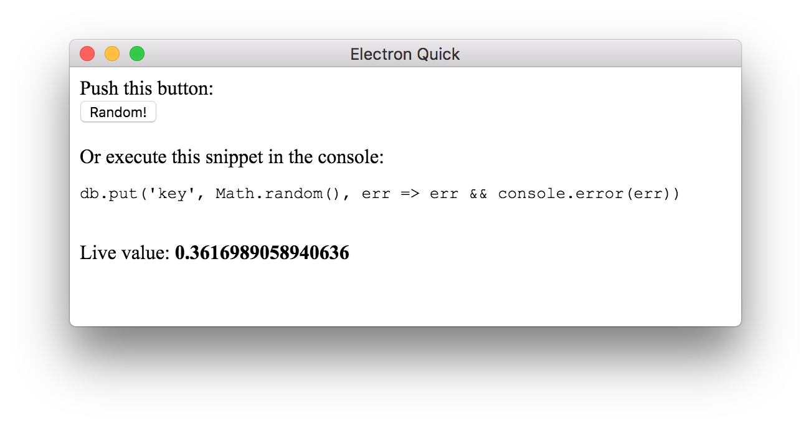

# preact-level-value

Live updating [leveldb](https://leveldb.org) value component for [preact](https://preactjs.com/)!

## Example

```js
import { h, render, Component } from 'preact'
import level from 'level'
import { Value } from 'preact-level-value'

const db = level('/tmp/preact-level-value')

class Example extends Component {
  render () {
    return <div id="example">
        Live value: <strong><Value db={db} key="key" /></strong>
      </div>
  }
}
```

Now the `<Value />` component will always reflect the value you have stored in your database at `key`.

Find a full example in [/example](example):

```bash
$ npm install
$ npm run rebuild
$ npm start
```



## Installation

```bash
$ npm install preact-level-value
```

## API

### `<Value db key />`

## License

MIT
